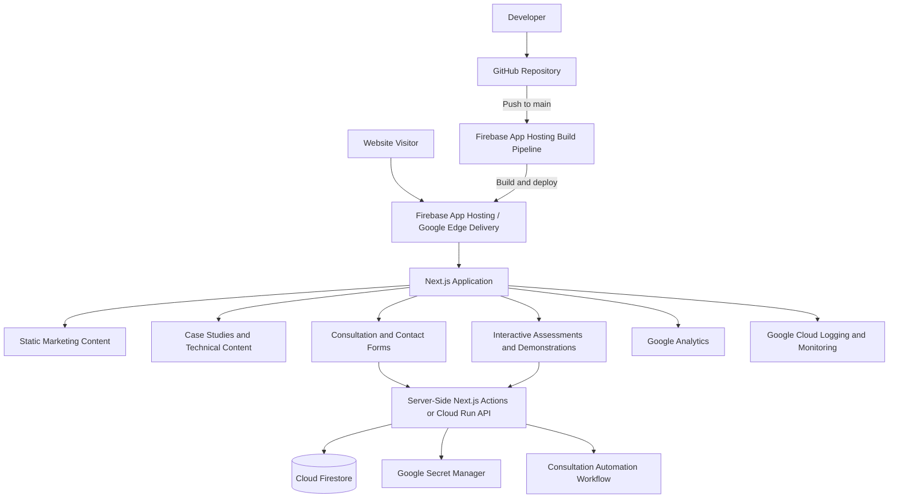

# McQueen Cloud Website Architecture

## Overview

The McQueen Cloud Advisory website is designed as more than a static marketing site. It is intended to demonstrate the same qualities the company offers to clients: clear architecture, automated delivery, secure cloud integration, and practical business workflows.

The initial implementation uses **Next.js**, **GitHub**, and **Firebase App Hosting**. This creates a professional, production-ready foundation while avoiding unnecessary complexity during the first phase of development.

## Architecture Diagram

## Current Phase

The current implementation includes:

- A Next.js application written in TypeScript
- Source control hosted in GitHub
- Automatic production deployments from the `main` branch
- Firebase App Hosting as the managed deployment platform
- A temporary `hosted.app` URL for testing
- The existing public website left unchanged during development

## Technology Choices

### Next.js

Next.js was selected because it supports both static content and dynamic application features within the same codebase.

This allows the website to begin as a fast, content-focused site while retaining the ability to add:

- Server-rendered pages
- Interactive tools
- Secure form processing
- API routes and server actions
- Dynamic case studies
- Authentication or client-facing features later

Using Next.js avoids the need to rebuild the site on a different framework when those capabilities are introduced.

### TypeScript

TypeScript provides static type checking for application code.

This reduces avoidable runtime errors, improves maintainability, and makes future integrations easier to understand and modify.

### Firebase App Hosting

Firebase App Hosting was selected instead of traditional shared hosting because it provides:

- Native support for modern web frameworks
- Managed builds and deployments
- Automatic HTTPS
- Google-managed infrastructure
- Integration with GitHub
- Automatic rollouts from the production branch
- A direct path to Firebase and Google Cloud services

This also keeps the website aligned with McQueen Cloud Advisory's Google Cloud positioning.

### GitHub

GitHub is the source of truth for the website code.

Every meaningful change should be committed to the repository. The production environment is updated through an automated deployment triggered by changes pushed to the `main` branch.

This provides:

- Version history
- Change traceability
- Rollback capability
- Separation between local development and production
- A visible demonstration of modern development practices

### Automatic Deployment

Firebase App Hosting monitors the `main` branch.

The deployment flow is:

1. Code is changed locally.
2. The change is tested locally.
3. The change is committed to Git.
4. The commit is pushed to GitHub.
5. Firebase detects the new commit.
6. Firebase builds the application.
7. A successful build is deployed automatically.

This removes manual file uploads and reduces the risk of deploying inconsistent code.

## Planned Architecture

The website will be expanded in controlled phases.

### Phase 1: Professional Website Foundation

- Navigation and footer
- Responsive page layouts
- Brand styling
- Service pages
- Case studies
- About page
- Contact page
- Search and social metadata
- Custom domain migration

### Phase 2: Demonstrated Capability

- Operational maturity assessment
- Interactive architecture explorer
- Technical project walkthroughs
- Embedded demonstration videos
- Architecture diagrams
- Selected GitHub repository links

### Phase 3: Workflow Integration

- Structured consultation intake
- Secure server-side form processing
- Firestore-based lead records
- Automated confirmation messages
- Integration with the existing consultation preparation workflow
- Optional internal lead-status view

## Future Google Cloud Components

### Cloud Firestore

Firestore may be used for structured application data such as:

- Consultation inquiries
- Assessment responses
- Lead status
- Saved tool results

Marketing content should remain in version-controlled Markdown or MDX unless a database is genuinely needed.

### Cloud Run

Cloud Run may be added for backend workloads that exceed what should be handled directly by the website application.

Potential uses include:

- Consultation workflow integration
- AI-assisted analysis
- Document generation
- Long-running processing
- Secure external API calls

Cloud Run is not required for basic static pages.

### Secret Manager

Credentials and API secrets must not be stored in the source code or committed to GitHub.

Secret Manager will be used for sensitive configuration required by backend services.

### Google Analytics

Google Analytics will measure:

- Page traffic
- Case study engagement
- Assessment completion
- Consultation conversion
- Navigation behavior

Analytics should be used to improve the website rather than collect unnecessary data.

### Cloud Logging and Monitoring

Application and backend logs will support:

- Error diagnosis
- Deployment troubleshooting
- Service reliability monitoring
- Auditability of backend operations

## Security Principles

The website should follow these rules:

- Do not expose credentials in browser code.
- Do not commit secrets to GitHub.
- Validate form input on the server.
- Apply least-privilege access to Google Cloud services.
- Use restrictive Firestore security rules.
- Keep dependencies updated.
- Require successful builds before production deployment.
- Avoid collecting personal information that is not operationally necessary.

## Deliberate Non-Goals

The initial release will not include:

- Kubernetes
- A custom content management system
- A large microservice architecture
- User accounts
- A client portal
- An AI chatbot
- A database for static marketing content

These features would create complexity without adding enough value during the initial release.

## Architectural Principle

The website should serve as evidence of McQueen Cloud Advisory's capabilities.

It should not merely describe modern cloud practices. It should demonstrate them through:

- Version-controlled infrastructure and application code
- Automated deployment
- Clear documentation
- Secure integrations
- Useful interactive features
- Observable production behavior
- Practical design choices tied to business outcomes
