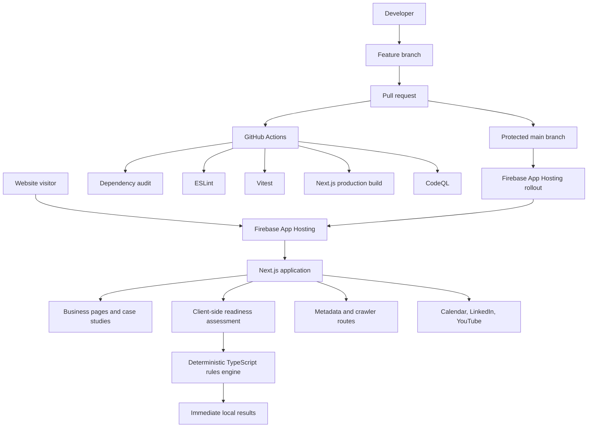
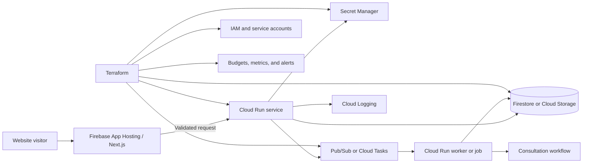

# McQueen Cloud Advisory Website Architecture

## Purpose

This document describes the architecture that is **implemented now**, the boundaries that are intentionally preserved, and the target-state patterns approved for future capabilities.

It does not treat planned services as though they already exist. Chronological implementation facts are maintained in `docs/DEVELOPMENT_NOTES.md`; those notes take precedence when this document has not yet been updated.

## Architectural goals

The application should:

- Support the public business and portfolio experience
- Demonstrate disciplined software delivery
- Keep recommendation logic deterministic and explainable
- Use managed services where they fit the operating requirement
- Minimize infrastructure that does not solve a real need
- Preserve a clear path to secure backend workflows
- Remain cost-sensitive and supportable by a small organization
- Apply 12-factor design principles where relevant
- Use test-driven development for new behavior
- Represent current and planned architecture honestly

## Current-state architecture



### Current runtime characteristics

- The public application is deployed through Firebase App Hosting.
- Firebase manages the framework-aware build and serving path.
- The managed platform uses Google Cloud infrastructure underneath, including Cloud Run-based runtime components.
- The readiness assessment executes in the browser.
- The assessment does not call a backend service.
- Assessment responses are not stored.
- The application does not currently own a Firestore database, authenticated API, or general-purpose backend service.
- Public content is version controlled in the repository.

### Current delivery path

```text
Local development
→ feature branch
→ pull request
→ CI and security validation
→ protected main branch
→ Firebase App Hosting build and rollout
→ production verification
```

CI and CD have separate responsibilities:

- GitHub Actions validates proposed changes.
- Firebase App Hosting builds and deploys approved changes from `main`.

A second GitHub deployment workflow is intentionally not maintained because it would duplicate the managed App Hosting release path.

## Implemented application components

### Public routes

```text
/
/services
/work
/work/consultation-automation
/work/enterprise-financial-reconciliation
/insights
/insights/why-this-site-uses-firebase-app-hosting
/about
/contact
/assessment
```

### Shared application layers

```text
app/               Route entry points and metadata routes
components/        Reusable presentation and interaction components
data/              Version-controlled content and rule definitions
lib/assessment/    Deterministic analysis engine
tests/assessment/  Automated behavioral tests
```

### Assessment engine boundaries

The engine is decomposed into explicit stages:

```text
score-domains
→ evaluate-gaps
→ evaluate-readiness
→ select-priorities
→ build-roadmap
→ analyze-assessment
```

This separation allows each behavior to be tested and changed without turning the assessment into a single opaque function.

Generative AI is not the source of truth for readiness, constraint, or roadmap decisions. AI may later assist with wording or presentation, but deterministic rules must remain authoritative unless the product requirements explicitly change.

## Current operational characteristics

### Reliability

- Production changes pass required CI before merge.
- Firebase rollouts are visible and reversible through managed revision history.
- Unit tests cover critical assessment paths and edge cases.
- Static pages do not depend on a database or external API to render.
- The application currently has little server-side state, reducing runtime failure modes.

### Observability

Current observability includes:

- Firebase App Hosting rollout status
- Google Cloud request and service logs
- GitHub Actions history
- CodeQL results
- Local and CI build output

Known follow-up work includes:

- Classifying recurrent 4xx paths
- Confirming whether failures are expected bot probes, stale URLs, or missing assets
- Correcting App Hosting scaling configuration if the managed service repeatedly requests a maximum instance count above the enforced project limit
- Adding explicit alerting only when it produces actionable operating value

### Cost sensitivity

The current design avoids always-on custom infrastructure.

Cost principles:

- Prefer scale-to-zero managed services
- Set explicit request, upload, and processing limits before introducing public backend endpoints
- Use budget alerts before adding variable-cost workflows
- Avoid persistent compute for low-volume workloads
- Add asynchronous processing only when request duration or reliability justifies it
- Treat abuse prevention as part of architecture, not an afterthought

## Twelve-factor alignment

The Twelve-Factor App methodology is applied where it maps cleanly to a managed Next.js and Cloud Run environment.

### I. Codebase

**Current:** One GitHub repository is the source of truth for the application.

**Rule:** Environment differences must not be represented by divergent code copies or long-lived environment branches.

### II. Dependencies

**Current:** Dependencies are declared in `package.json` and locked in `package-lock.json`.

**Rule:** Use `npm ci` in CI and reproducible environments. Do not rely on globally installed application dependencies.

### III. Config

**Current:** Public site configuration uses environment variables where needed, such as the production site URL.

**Rule:** Deploy-specific configuration belongs in environment configuration. Secrets must never be committed or exposed through `NEXT_PUBLIC_*` variables.

### IV. Backing services

**Current:** External calendar and social channels are links, not application backing services. No database is required.

**Rule:** Future Firestore, Pub/Sub, Secret Manager, Cloud Storage, or external APIs must be treated as replaceable attached resources with explicit configuration contracts.

### V. Build, release, run

**Current:** GitHub Actions validates; Firebase builds, releases, and runs.

**Rule:** Do not perform schema migration, secret creation, or hidden environment mutation during application startup.

### VI. Processes

**Current:** Public application behavior is effectively stateless.

**Rule:** Future Cloud Run processes must remain stateless. Durable state belongs in backing services.

### VII. Port binding

**Current:** Firebase manages application serving.

**Rule:** Independently deployed Cloud Run services must expose HTTP through the runtime-provided port and own a clear service interface.

### VIII. Concurrency

**Current:** Scaling is managed by App Hosting and its underlying runtime.

**Rule:** Backend services must scale horizontally. Per-instance memory must not be used as shared durable state.

### IX. Disposability

**Rule:** Future services should start quickly, stop safely, and tolerate instance replacement. Long-running tasks should use resumable or asynchronous designs.

### X. Dev/prod parity

**Current:** Local and CI dependency versions are aligned through the lockfile.

**Rule:** Use emulators or test doubles only with documented behavioral differences. Avoid workflows that can be exercised only through production consoles.

### XI. Logs

**Current:** Platform and build logs are centralized through GitHub and Google Cloud.

**Rule:** Backend application code writes structured events to standard output and error streams. It must not manage local log files.

### XII. Admin processes

**Rule:** Maintenance, backfills, and migrations run as explicit, versioned one-off jobs with the same code and configuration model as the deployed service.

## Test-driven development architecture rule

Behavioral changes should begin with a test whenever a stable input/output or state-transition contract exists.

### Required TDD areas

- Assessment and recommendation rules
- Input schemas and validation
- Authorization decisions
- API request and response contracts
- Rate, file-size, and cost guards
- Data transformations
- Retry and idempotency behavior
- Integration adapters
- Failure handling
- Roadmap and report-generation logic

### Testing layers

```text
Unit tests
→ component tests
→ contract tests
→ integration tests
→ end-to-end browser tests
```

Not every feature needs every layer. Tests should be placed at the lowest layer that gives trustworthy coverage.

### Definition of done for new behavior

A feature is not complete until:

- Expected behavior is specified
- Relevant tests exist and pass
- Error and boundary conditions are covered
- Lint and production build pass
- Security and cost implications are reviewed
- Documentation is updated when the architecture or operating model changes

## Infrastructure as code strategy

### Principle

Infrastructure as code should describe **real, owned, reproducible infrastructure**. It should not be added merely to create the appearance of cloud complexity.

### Why Cloud Run is the likely entry point

Firebase App Hosting manages the public web runtime. The clearest independent infrastructure boundary is a backend capability deployed directly to Cloud Run.

A future backend could support:

- Secure consultation intake
- Assessment report generation
- Optional result sharing
- Consultation-preparation workflow handoff
- Controlled document generation
- External API integration
- Asynchronous processing

### Proposed target-state boundary



The diagram is a target pattern, not a statement that these resources currently exist.

### Terraform scope for the first backend capability

A first `infra/` layer should manage only the resources required by the selected feature:

```text
infra/
├── environments/
│   ├── dev/
│   └── prod/
├── modules/
│   ├── cloud-run-service/
│   ├── service-account/
│   └── monitoring/
├── providers.tf
├── versions.tf
└── README.md
```

Potential managed resources:

- Project service/API enablement
- Dedicated runtime service account
- Least-privilege IAM
- Artifact Registry repository, if directly required
- Cloud Run service or job
- Secret Manager secret resources
- Firestore or Cloud Storage resources
- Pub/Sub or Cloud Tasks resources
- Budget notifications
- Log-based metrics and alert policies

Secret values remain outside Terraform state unless a documented and protected state strategy explicitly permits otherwise. Prefer creating the secret container in Terraform and injecting the value through an approved administrative process.

### Terraform state

Before IaC is adopted, the project must document:

- Remote state location
- State encryption and access
- State locking behavior
- Separate development and production state
- Recovery and import procedures
- Who can apply production changes

For a solo-maintainer portfolio project, a secured Google Cloud Storage backend is likely sufficient once a real IaC stack exists.

### What should not be duplicated

Do not create:

- A second deployment pipeline for the Firebase-managed site
- Terraform resources for services not used by an application feature
- Secret Manager lookups without an actual secret-dependent capability
- Multiple Cloud Run services where one bounded service is sufficient
- Kubernetes infrastructure for a low-volume website backend

## Current-state versus target-state matrix

| Capability | Current state | Approved direction |
| --- | --- | --- |
| Public web hosting | Firebase App Hosting | Retain unless operating requirements change |
| CI | GitHub Actions | Expand with accessibility and end-to-end checks |
| CD | Firebase App Hosting from `main` | Retain; do not duplicate |
| Assessment execution | Client-side deterministic engine | Retain deterministic source of truth |
| Assessment storage | None | Add only for explicit sharing or lead-capture use cases |
| Authentication | None | Add only when privileged or saved features require it |
| Backend API | None owned directly by this repository | Use Cloud Run for a real bounded capability |
| Secrets | No runtime secret requirement in the public app | Use Secret Manager when a backend integration requires it |
| Database | None | Firestore only when persistence is justified |
| IaC | Not yet implemented | Terraform around the first owned backend boundary |
| Logging | Managed platform logs | Add structured application events and actionable alerts |
| Analytics | Not yet established as a required system | Add only with explicit privacy and conversion goals |
| TDD | Implemented for assessment engine | Default development method for future behavior |

## Security architecture

### Current controls

- Protected `main` branch
- Pull-request workflow
- Required CI
- Immutable third-party action SHAs
- Dependency auditing
- CodeQL scanning
- No committed secrets
- No assessment PII or persistence
- Client and server boundaries kept explicit
- Confidential case-study data anonymized

### Future backend controls

Every backend feature must define:

- Threat model
- Data classification
- Authentication requirement
- Authorization rules
- Input validation
- Rate and size limits
- Service identity
- IAM permissions
- Secret use
- Retention and deletion
- Structured logging
- Abuse and cost controls
- Recovery behavior

## Site-content architecture

The public site should lead with outcomes while preserving technical depth.

### Case-study hierarchy

```text
Measurable outcome
Operating problem
Constraints and affected work
Design objectives
Architecture
Implementation choices
Controls and tradeoffs
Operational effect
Technical stack
```

Technology chips should not outrank the problem or result in the hero section.

### Engineering knowledge base integration

The separate cloud-engineering learning resource should be surfaced as supporting evidence, not merged into the primary business journey.

Preferred placements:

- About-page authority section
- Insights-hub feature card
- Footer link
- Contextual deep links from technical content

A primary-navigation link should be added only if usage evidence shows it helps rather than distracts business visitors.

## Planned refactor and implementation sequence

### Phase A — Documentation and positioning

1. Keep current and planned architecture explicitly separated.
2. Update case-study hero hierarchy.
3. Surface the engineering knowledge base in secondary locations.
4. Add a concise architecture status section to public technical content.

### Phase B — Quality-system expansion

1. Add automated accessibility testing.
2. Add Playwright end-to-end tests for critical routes and assessment flow.
3. Add component tests for shared engagement and navigation behavior.
4. Define test fixtures for assessment profiles.
5. Add coverage expectations only after the suite is representative.

### Phase C — Operational hardening

1. Classify 4xx traffic by path and status.
2. Confirm App Hosting scaling configuration.
3. Add `apphosting.yaml` only when a verified configuration mismatch requires it.
4. Define error budgets and actionable alerts for user-facing failures.
5. Add privacy-conscious analytics only when decisions will be made from it.

### Phase D — First IaC-backed backend

1. Select one real backend capability.
2. Write acceptance criteria and tests before implementation.
3. Define its service and data boundaries.
4. Create Terraform for service account, IAM, Cloud Run, secrets, and monitoring.
5. Implement the service as a stateless 12-factor process.
6. Add contract and integration tests.
7. Add budget, rate, request-size, and abuse safeguards.
8. Deploy to a non-production environment before production.
9. Document actual behavior and operational runbooks.

## Deliberate non-goals

Until requirements justify them, the architecture excludes:

- Kubernetes or GKE
- A broad microservice estate
- A custom CMS
- A database for static content
- User accounts
- A client portal
- An AI chatbot
- Redundant deployment workflows
- Placeholder backend services
- Portfolio-only secrets or infrastructure

## Architectural decision rule

Every proposed technology must answer:

1. What operating problem does it solve?
2. Why is the current design insufficient?
3. What new cost, security, and support obligations does it introduce?
4. How will it be tested?
5. How will it be deployed and observed?
6. Can a simpler managed service meet the need?
7. Does the repository prove the capability rather than merely describe it?

The smallest design that credibly satisfies the requirement is preferred.
