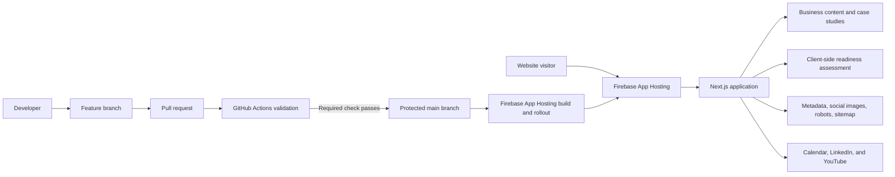

# McQueen Cloud Advisory Website

The production website for **McQueen Cloud Advisory**, built as both a business-facing application and a public demonstration of disciplined cloud application delivery.

The repository is treated as a production software project rather than a collection of marketing pages. It contains the live Next.js application, the deterministic Operational Modernization Readiness Assessment, automated tests, continuous integration, deployment configuration, technical case studies, and supporting documentation.

Production site: `https://www.mcqueencloud.com`

## What this repository proves today

Implemented and deployed capabilities include:

- A production Next.js application written in TypeScript
- Responsive, accessible navigation and page layouts
- Services, Work, Insights, About, Contact, and Assessment routes
- Two completed public case studies
- A 24-question Operational Modernization Readiness Assessment
- A deterministic, dependency-aware recommendation engine
- Automated unit tests for assessment logic and edge cases
- GitHub Actions validation for dependency auditing, linting, tests, and builds
- Protected pull-request delivery into `main`
- Automatic production rollout through Firebase App Hosting
- Generated Open Graph and Twitter/X images
- Dynamic `robots.txt` and sitemap routes
- A custom production domain served over HTTPS
- Contextual engagement paths for visitors with different levels of readiness

The repository does **not** currently contain a general-purpose backend platform, Firestore data model, user-authentication system, or Terraform-managed application infrastructure. Those are potential future capabilities and are not represented as implemented features.

## Product purpose

The site serves two audiences:

1. **Prospective clients**, who need to understand the operating problems McQueen Cloud Advisory helps solve.
2. **Technical evaluators and hiring managers**, who need evidence of architecture, development discipline, testing, deployment, and engineering judgment.

The site therefore uses a dual-speed content model:

- Business-facing pages lead with operating problems, outcomes, constraints, and decision value.
- Technical readers can inspect architecture decisions, implementation notes, tests, repository history, and technical articles without forcing non-technical visitors through unnecessary detail.

## Current architecture



The current assessment runs entirely in the browser:

```text
24 responses
→ domain scoring
→ gap evaluation
→ opportunity readiness
→ primary constraint
→ best opportunity
→ modernization stage
→ 90-day roadmap
→ deferrals
→ support model
```

No assessment answers are persisted, and no personal information is required.

See [`docs/ARCHITECTURE.md`](docs/ARCHITECTURE.md) for current-state boundaries, target-state options, 12-factor alignment, testing expectations, and infrastructure-as-code strategy.

## Technology stack

| Area | Current technology |
| --- | --- |
| Web framework | Next.js |
| Language | TypeScript |
| Styling | Tailwind CSS |
| Hosting and runtime | Firebase App Hosting |
| Underlying managed runtime | Google Cloud managed build and Cloud Run infrastructure |
| Source control | GitHub |
| Continuous integration | GitHub Actions |
| Continuous deployment | Firebase App Hosting from `main` |
| Unit testing | Vitest |
| Static analysis | ESLint and CodeQL |
| Package management | npm |
| Public domain | `www.mcqueencloud.com` |

## Repository structure

```text
mcqueen-cloud-website/
├── app/
├── components/
│   ├── assessment/
│   ├── engagement/
│   └── layout/
├── data/
├── lib/
│   └── assessment/
├── tests/
│   └── assessment/
├── docs/
│   ├── assessment-spec.md
│   ├── DEVELOPMENT_NOTES.md
│   └── ARCHITECTURE.md
├── .github/
│   └── workflows/
│       └── ci.yml
├── README.md
├── package.json
├── package-lock.json
├── tsconfig.json
├── vitest.config.ts
└── eslint.config.mjs
```

## Local development

### Prerequisites

- Node.js 22
- npm
- Git

### Clone

```bash
git clone https://github.com/McQueen-Cloud-Advisory/mcqueen-cloud-website.git
cd mcqueen-cloud-website
```

### Install dependencies

```bash
npm ci
```

### Run locally

```bash
npm run dev
```

Open:

```text
http://localhost:3000
```

### Run the complete local validation sequence

```bash
npm run lint
npm test
npm run build
git diff --check
```

All four checks should pass before a pull request is opened.

## Development workflow

The protected delivery path is:

```text
Feature branch
→ Pull request
→ dependency audit
→ lint
→ unit tests
→ production build
→ CodeQL
→ review resolution
→ merge to main
→ Firebase App Hosting rollout
```

Create a branch:

```bash
git switch main
git pull origin main
git switch -c feature/descriptive-name
```

Commit and push:

```bash
git add .
git commit -m "Describe the change"
git push -u origin feature/descriptive-name
```

Open a pull request into `main`. Direct production changes are intentionally avoided.

After merge:

```bash
git switch main
git pull origin main
git branch -d feature/descriptive-name
```

## Test-driven development standard

New behavior should be developed test-first whenever the behavior can be expressed as a deterministic contract.

The expected sequence is:

1. Write or update a test that describes the desired behavior.
2. Confirm the test fails for the expected reason.
3. Implement the smallest change that makes the test pass.
4. Refactor while keeping the test suite green.
5. Run lint, tests, build, and whitespace validation.
6. Document material architectural or behavioral decisions.

TDD is especially important for:

- Assessment scoring
- Dependency and readiness rules
- Roadmap assembly
- Input validation
- Server-side actions
- Authorization rules
- Integration adapters
- Cost and usage safeguards

Purely presentational changes may use visual validation first, but reusable component behavior should still receive automated coverage where practical.

## Twelve-factor design commitment

The project adopts the Twelve-Factor App methodology where it applies to a managed Next.js application.

Key commitments include:

- **Codebase:** one version-controlled codebase with multiple deploys
- **Dependencies:** explicit dependencies through `package.json` and `package-lock.json`
- **Config:** deploy-specific configuration supplied through environment configuration, not hard-coded secrets
- **Backing services:** databases, queues, APIs, and storage treated as attached resources
- **Build, release, run:** CI validation remains separate from Firebase release and runtime stages
- **Processes:** future server-side workloads remain stateless; durable state belongs in backing services
- **Port binding:** Cloud Run services expose their own HTTP interfaces
- **Concurrency:** scaling occurs horizontally through managed process instances
- **Disposability:** services should start quickly and handle termination safely
- **Dev/prod parity:** local, CI, and production dependency versions remain aligned through the lockfile
- **Logs:** application processes write structured events to standard output and error streams
- **Admin processes:** migrations or maintenance tasks run as explicit one-off jobs rather than hidden application startup behavior

Not every factor creates a visible artifact in the current mostly client-side application. The rules become more important as real backend capabilities are introduced.

## Infrastructure as code strategy

Infrastructure as code will be added only around resources the project actually owns and must reproduce.

### Good initial IaC candidates

A future Terraform layer could manage:

- Required Google Cloud APIs
- Dedicated service accounts
- Least-privilege IAM bindings
- A real Cloud Run backend service
- Secret Manager secret containers, without committing secret values
- Cloud Logging metrics and alert policies
- Budget alerts and cost safeguards
- Optional Firestore databases and indexes when persistence is justified
- Cloud Scheduler, Pub/Sub, or Cloud Tasks when an asynchronous workflow needs them

### What should remain managed

Firebase App Hosting currently manages the website build and serving path. The repository should not create a parallel deployment mechanism merely to display more infrastructure files.

Terraform should begin when the application introduces a real independently managed boundary, most likely:

```text
Next.js site
→ validated server-side request
→ Cloud Run application service
→ attached backing services
```

The first IaC-backed backend should solve a real user or operating need, not exist as a portfolio-only demonstration.

## Security and privacy boundaries

Current controls and design rules include:

- No credentials committed to GitHub
- No secrets exposed through client-side code
- No assessment answer persistence
- No required personal-information collection for assessment use
- Protected delivery into `main`
- Immutable SHA pins for third-party GitHub Actions
- Production dependency auditing
- CodeQL scanning
- Human review retained for advisory and controlled-process outputs
- Confidential enterprise project details anonymized

Future backend work must add:

- Server-side input validation
- Explicit authentication and authorization where required
- Least-privilege service identities
- Secret Manager for runtime secrets
- Structured logs without sensitive payloads
- Retention and deletion rules for stored data
- Abuse, rate, size, and cost controls

## Case-study content standard

Case studies should lead with the operating problem and measurable outcome before presenting the technology stack.

Preferred structure:

```text
Outcome
Operating problem
Constraints
Design objectives
Architecture
Implementation decisions
Controls and reliability
Tradeoffs
Result and operational effect
Technical implementation details
```

Technology is the mechanism behind the result, not the first value proposition.

## Documentation authority

The project documents have different roles:

- `docs/DEVELOPMENT_NOTES.md` — chronological source of truth for implemented work and resolved issues
- `docs/ARCHITECTURE.md` — current architecture, boundaries, design rules, and approved target-state direction
- `README.md` — repository entry point, setup, workflows, current capabilities, and contributor expectations
- `docs/assessment-spec.md` — functional specification for the assessment engine

When documents disagree, the most recent development notes take precedence until the other documents are reconciled.

## Current roadmap

Near-term priorities:

1. Reorder case-study heroes so outcomes precede technology.
2. Add explicit current-state and target-state labels throughout public documentation.
3. Surface the cloud-engineering knowledge base through About, Insights, and the footer without crowding primary navigation.
4. Add automated accessibility checks and end-to-end browser tests.
5. Investigate recurrent 4xx request paths and App Hosting scaling configuration.
6. Select the next real backend capability and design it with TDD, 12-factor principles, and Terraform from the beginning.

Potential backend candidates include:

- Secure consultation intake
- Optional assessment result sharing
- Consultation workflow handoff
- Downloadable assessment report generation
- Controlled asynchronous document generation

## Deliberate non-goals

The project does not add the following without a demonstrated need:

- Kubernetes
- A custom content management system
- A large microservice architecture
- User accounts
- A client portal
- An AI chatbot
- A database for static marketing content
- A redundant GitHub deployment workflow
- A purposeless Secret Manager integration
- Infrastructure created only to make the repository appear more complex

## License

This repository contains proprietary website content and implementation work for McQueen Cloud Advisory.

Unless otherwise stated, the source code and content are not licensed for redistribution or commercial reuse.
