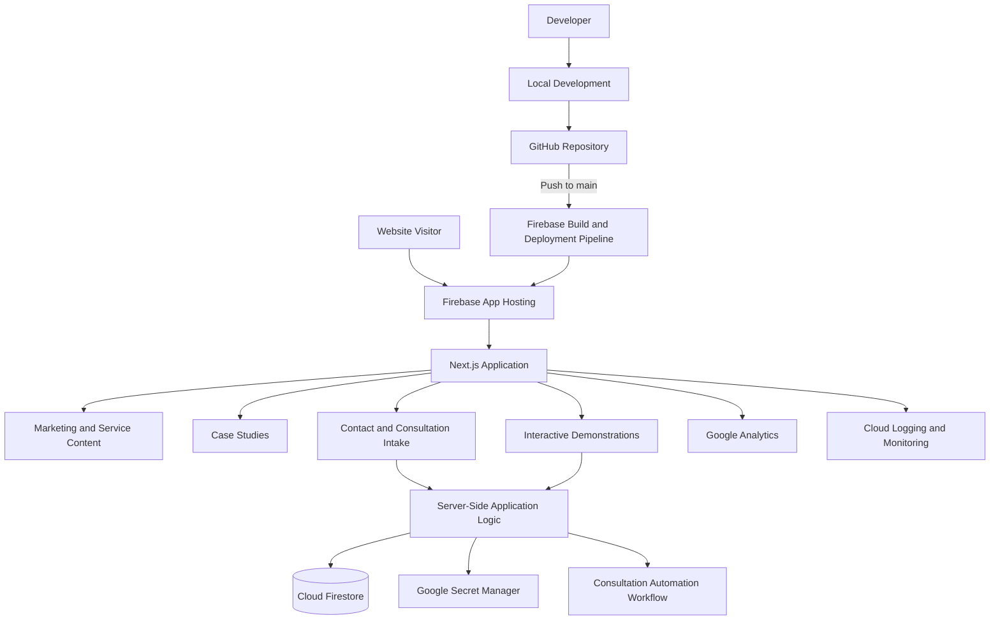
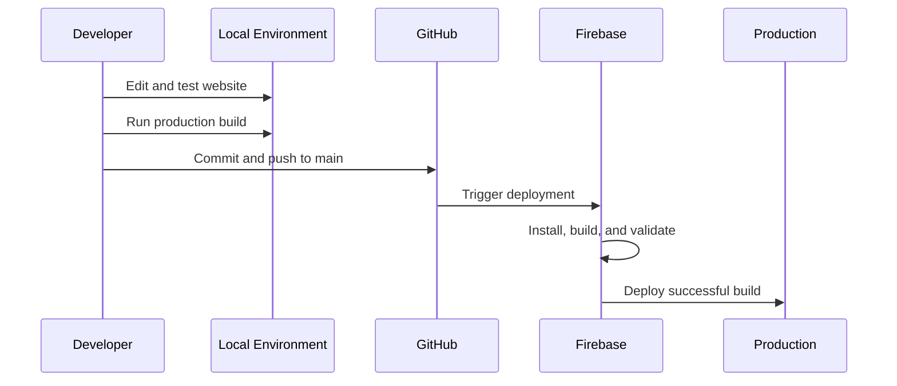

# McQueen Cloud Advisory Website

The public website for **McQueen Cloud Advisory**, built as both a professional business site and a working demonstration of modern cloud application practices.

The site is designed to do more than describe services. It is intended to demonstrate the same capabilities offered to clients:

* Cloud-native application delivery
* Automated deployment
* Analytics and reporting
* Workflow automation
* Secure Google Cloud integration
* Clear technical documentation
* Practical architecture decisions tied to business outcomes

## Current Status

The project is in its initial foundation phase.

Currently implemented:

* Next.js application
* TypeScript
* Tailwind CSS
* GitHub source control
* Firebase App Hosting
* Automatic deployment from the `main` branch
* Temporary Firebase `hosted.app` environment
* Local development environment
* Production build validation

The existing public website remains active while the replacement is developed and tested.

## Architecture



A more detailed architecture explanation is available in:

```text
ARCHITECTURE.md
```

## Technology Stack

| Component                | Technology                           |
| ------------------------ | ------------------------------------ |
| Web framework            | Next.js                              |
| Language                 | TypeScript                           |
| Styling                  | Tailwind CSS                         |
| Hosting                  | Firebase App Hosting                 |
| Source control           | GitHub                               |
| Deployment               | Automatic rollout from `main`        |
| Planned data storage     | Cloud Firestore                      |
| Planned backend services | Next.js server actions and Cloud Run |
| Secret management        | Google Secret Manager                |
| Analytics                | Google Analytics                     |
| Monitoring               | Google Cloud Logging and Monitoring  |

## Why Next.js

Next.js supports both static website content and dynamic application functionality within the same codebase.

This allows the site to begin as a fast professional website while retaining the ability to add:

* Server-rendered pages
* Interactive assessments
* Secure form processing
* API endpoints
* Dynamic case studies
* Workflow integrations
* Authentication, if later justified

This avoids rebuilding the platform when more advanced capabilities are introduced.

## Why Firebase App Hosting

Firebase App Hosting was selected because it provides a managed deployment platform for modern web applications while remaining closely integrated with Google Cloud.

Key benefits include:

* GitHub-based deployment
* Automatic HTTPS
* Managed build infrastructure
* Automatic production rollouts
* Google-managed hosting
* Integration with Firebase and Google Cloud services
* Support for modern application frameworks
* Reduced infrastructure management

The website currently deploys automatically whenever a successful commit is pushed to the `main` branch.

## Deployment Workflow



The standard deployment process is:

1. Make changes locally.
2. Test the application locally.
3. Run a production build.
4. Commit the changes.
5. Push to GitHub.
6. Firebase detects the new commit.
7. Firebase builds and deploys the application.
8. Verify the rollout in Firebase App Hosting.

## Local Development

### Prerequisites

Install:

* Node.js
* npm
* Git
* Visual Studio Code or another code editor

### Clone the repository

```bash
git clone https://github.com/scottmcqueen2023/mcqueen-cloud-website.git
cd mcqueen-cloud-website
```

### Install dependencies

```bash
npm install
```

### Start the development server

```bash
npm run dev
```

Open:

```text
http://localhost:3000
```

### Validate a production build

Before pushing major changes, run:

```bash
npm run build
```

The build should complete successfully before the code is deployed.

## Git Workflow

Check the current repository status:

```bash
git status
```

Stage changes:

```bash
git add .
```

Commit changes:

```bash
git commit -m "Describe the change"
```

Push to the production branch:

```bash
git push origin main
```

A push to `main` triggers an automatic Firebase App Hosting rollout.

## Planned Site Structure

The planned public website will include:

```text
/
├── Home
├── Services
│   ├── Analytics and BI Modernization
│   ├── Workflow Automation
│   ├── Google Cloud Architecture
│   └── AI-Enabled Knowledge Workflows
├── Case Studies
├── Technical Insights
├── About
├── Contact
└── Interactive Tools
```

## Planned Features

### Phase 1: Professional Foundation

* Responsive navigation
* Footer
* Brand typography and colors
* Service pages
* About page
* Contact page
* Case study templates
* Search metadata
* Social sharing metadata
* Accessibility improvements
* Custom domain migration

### Phase 2: Demonstrated Capability

* Operational maturity assessment
* Architecture recommendation explorer
* Technical project walkthroughs
* Embedded demonstration videos
* Architecture diagrams
* Selected GitHub repository links
* Measurable case study outcomes

### Phase 3: Workflow Integration

* Structured consultation intake
* Server-side form validation
* Firestore lead records
* Automated confirmation messages
* Integration with the existing consultation preparation workflow
* Optional internal lead-management interface

## Content Strategy

The website will prioritize evidence over marketing claims.

Case studies should follow this structure:

```text
Problem
Constraints
Architecture
Implementation
Tradeoffs
Outcome
Lessons Learned
```

Where permitted, case studies should include:

* Architecture diagrams
* Screenshots
* Technology choices
* Design rationale
* Security considerations
* Deployment approach
* Measurable results
* Known limitations

Confidential enterprise work must be anonymized and stripped of proprietary details.

## Security Principles

The project will follow these baseline security practices:

* Do not commit credentials or secrets to GitHub.
* Do not expose private credentials in browser code.
* Validate all form submissions on the server.
* Use least-privilege access for Google Cloud services.
* Store sensitive configuration in Secret Manager.
* Use restrictive Firestore security rules.
* Avoid unnecessary collection of personal information.
* Keep dependencies current.
* Review deployment logs for failures and anomalies.
* Separate public content from privileged backend operations.

## Architectural Boundaries

The initial release will deliberately avoid unnecessary complexity.

The project will not initially include:

* Kubernetes
* A custom content management system
* A large microservice architecture
* User accounts
* A client portal
* An AI chatbot
* A database for static marketing content
* Multiple backend services without a clear need

These features may be considered later only if they solve a real business problem.

## Project Principles

The project is guided by the following principles:

1. **Demonstrate capability instead of merely claiming it.**
2. **Prefer simple managed services over unnecessary infrastructure.**
3. **Keep content version controlled whenever practical.**
4. **Automate repeatable deployment processes.**
5. **Document architectural choices and tradeoffs.**
6. **Add complexity only when justified by user or business needs.**
7. **Treat the website as a production application, not a digital brochure.**

## Repository Structure

The exact structure may evolve, but the project will generally follow:

```text
mcqueen-cloud-website/
├── public/
├── src/
│   └── app/
│       ├── layout.tsx
│       ├── page.tsx
│       └── globals.css
├── ARCHITECTURE.md
├── README.md
├── next.config.ts
├── package.json
├── package-lock.json
├── tsconfig.json
└── eslint.config.mjs
```

## Documentation

Project documentation includes:

* `README.md` — project overview, setup, workflow, and roadmap
* `ARCHITECTURE.md` — architecture diagram, technology choices, security principles, and planned cloud integrations

Additional architecture decision records may be added later under:

```text
docs/decisions/
```

## Production Environment

The current production test environment is hosted through Firebase App Hosting.

The custom domain will not be moved until:

* Core pages are complete
* Mobile layouts are validated
* Contact workflows are tested
* Search metadata is configured
* Analytics is working
* The production build is stable
* Redirect and domain settings are prepared

## License

This repository contains proprietary website content and implementation work for McQueen Cloud Advisory.

Unless otherwise stated, the source code and content are not licensed for redistribution or commercial reuse.
